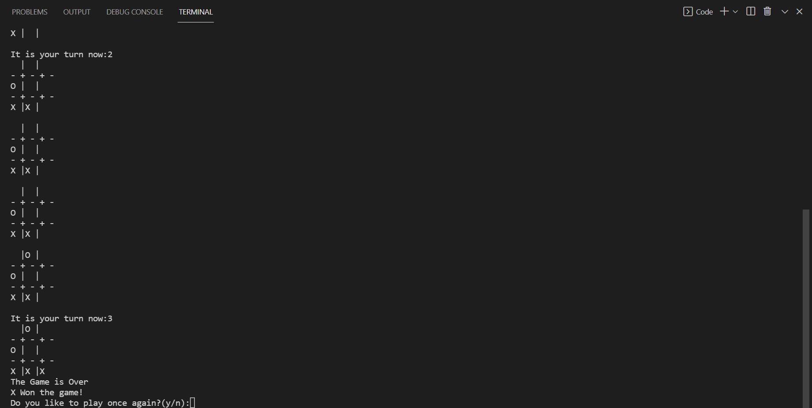
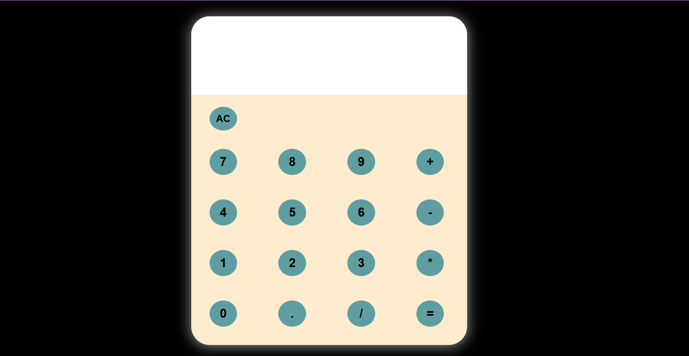
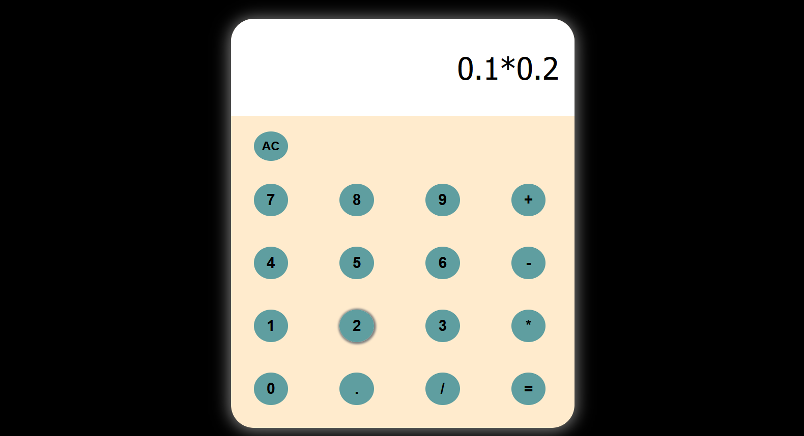
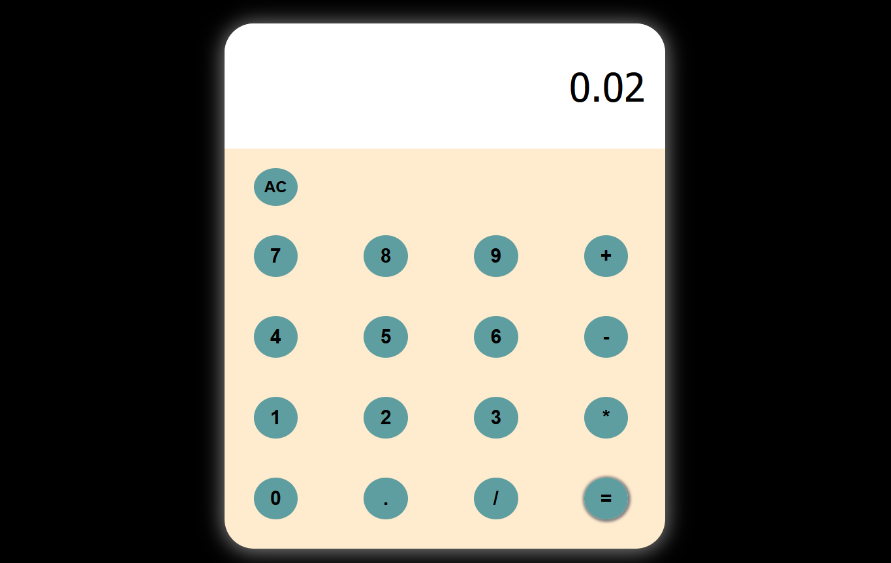
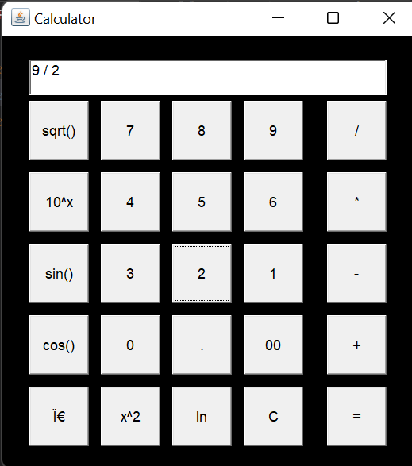
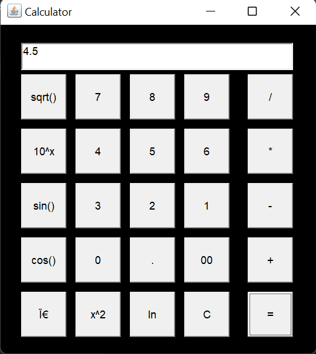

# Mini projects

Hello there 🖐

This is a list of my Mini projects that I did 💻.

If you find something wrong in my code or willing to add new features to my code, just give me a pull request 🛠.

I will review your code and merge it with my code 🧲.

### Preview Images,

#### For TicTacToe(CLI),

<kbd></kbd>  
<kbd></kbd> 

#### For Calculator using JavaScript,

<kbd></kbd> 
<kbd></kbd> 
<kbd></kbd> 

#### For Calculator using Java AWT

<kbd></kbd> 
<kbd></kbd> 

Thankyou 🙏!

